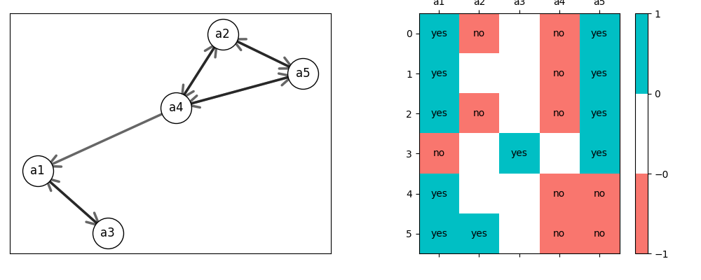
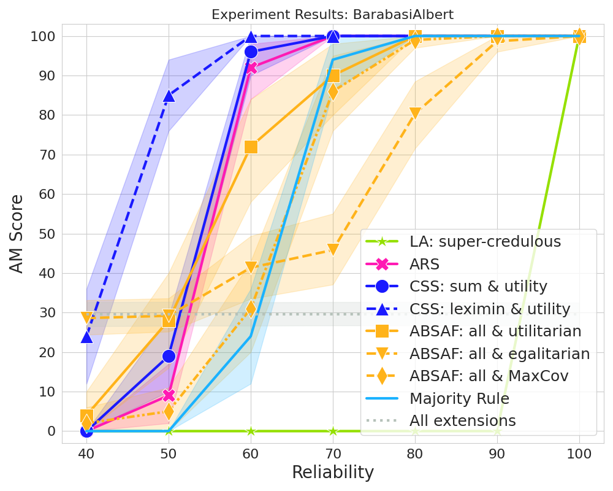

# Votes in Abstract Argumentation

This project explores various Collective Opinion Semantics (COS) methods applied to the Opinion Based Argumentation framework (OBAFS).

We implement four COS methods in Python, adapting them to work with OBAFs:

1. **Judgement aggregation by Pigozzi and Caminada** [[1]](#1)
2. **Approval Based Social Argumentation Frameworks** (ABSAF) [[2]](#2)
3. **Collective Satisfaction Semantics** (our method [[5]](#5))
4. **Attack Removal Semantics** (our method [[5]](#5), based on [[3]](#3) and [[4]](#4))

## Startup

This project uses Python 3.10.12, and all the dependencies are in pyproject.toml file. For easy start-up use Poetry, follow these steps:

1. Install Poetry if you haven't already:
   ```bash
   curl -sSL https://install.python-poetry.org | python -
2. Navigate to your project directory.
3. Install dependencies:
   ```bash
   poetry install
4. The dataset is included in this repository via Git LFS for your convenience. 
You can clone the entire project, including data, using:

```bash
git clone https://github.com/JulieteRossie/VAST.git
```
The data is also available in Zenodo [https://zenodo.org/records/18305726](https://zenodo.org/records/18305726), if you have download issues in github, download the dataset from zenodo into the root of the project.


## Usage
Argumentation frameworks and votes are represented in .apx files as follows:
```
arg(a).
arg(b).
att(a,b).
att(b,a).
vote(v1,(a,1)).
vote(v2,(a,-1)).
vote(v2,(a,1),(b,-1).
```

### 1. Single File Demo
Run all implemented aggregation methods (CSS, ARS, JA, ABSAF, Majority Rule) on a specific .apx file.
```
poetry run python main.py demo --file <path_to_file> [--semantics <sem>] [--viz]
```
- ```--file```: Path to the input .apx file in the frameworks directory
- ```--semantics```: The semantics to use (e.g., pref, comp). Default: pref 
- ```--viz```: Optional flag to visualize the graph using Matplotlib

Example:
```
poetry run python main.py demo --file many-extensions.apx --semantics pref --viz
```
This example should display this OBAF:


### 2. Replicating our results
Replicate the experimental results presented in the paper. This process computes outcomes based on the Vast_dataset.db used in our experiments, and stores results in a SQLite database.
```
poetry run python main.py replicate --db <db_name> --graph <type> --semantics <sem> --args <n>
```
- ```--db```: Name of the database containins the results (e.g., results.db)
- ```--graph```: Graph type (e.g., BarabasiAlbert, ErdosRenyi, WattsStrogatz)
- ```--semantics```: Semantics to use
- ```--args```: Number of arguments in the used AFs

Example 1: launch the full experiment (warning: this will take a long time)
```
poetry run python main.py replicate --db results.db
```

Example 2: launch an experiment fragment (if you use the same name for all fragments they will all be saved in the same DB, this is useful to generate the results little by little because of how long it takes to launch it all at once)
```
poetry run python main.py replicate --db results.db --graph BarabasiAlbert --semantics pref --args 5
```

### 3. Plotting results
Generate the plots from your saved results.
```
poetry run python main.py plot --db <db_path> [--graph <type>] [--votes <n>]
```
- ```--db```: Path to the database containing experiment results
- ```--graph```: Graph type to filter results by. Default: BarabasiAlbert
- ```--votes```: Number of votes to analyze. Default: 50
- ```--gen_type```: Vote generator type used (e.g., Our_vote)

Example:
```
poetry run python main.py plot --db results.db
```
If you ran the previous command with the simple example of BarabasiAlbert and 5 arguments you should get 4 different plots, for example:


## References
<a id="1">[1]</a> 
Martin Caminada & Gabriella Pigozzi. (2011). 
On judgment aggregation in abstract argumentation. 
Auton Agent Multi-Agent Syst. 10.5555/3635637.3662864.

<a id="2">[2]</a> 
Michael Bernreitern, Jan Maly, Oliviero Nardi & Stefan Woltran. (2024). 
Combining Voting and Abstract Argumentation to Understand Online Discussions
23rd International Conference on Autonomous Agents and Multiagent Systems. 10.1007/s10458-009-9116-7.

<a id="3">[3]</a> 
Leila Amgoud & Claudette Cayrol. (2002). 
A Reasoning Model Based on the Production of Acceptable Arguments.
Annals of Mathematics and Artificial Intelligence. 10.1023/A:1014490210693.

<a id="4">[4]</a> 
João Leite & João Martins. (2011). 
Social Abstract Argumentation. 
International Joint Conference on Artificial Intelligence. 10.5591/978-1-57735-516-8/IJCAI11-381.

<a id="5">[5]</a> 
Juliete Rossie, Jérôme Delobelle, Sébastien Konieczny, Clément Lens & Srdjan Vesic. (2024). 
Collective Satisfaction Semantics for Opinion Based Argumentation. 
Proceedings of the 21st International Conference on Principles of Knowledge Representation and Reasoning. 10.24963/kr.2024/59.
